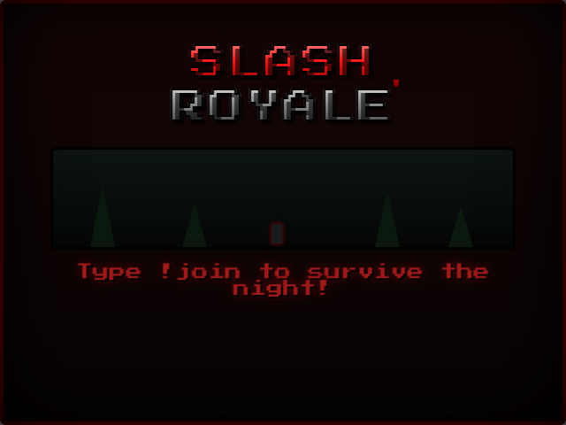
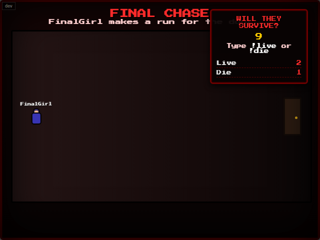
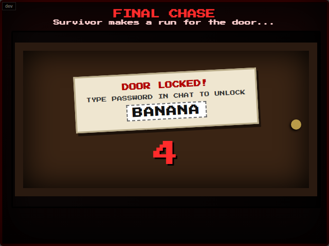

# Slash Royale - Serverless Edition

A lightweight, zero-setup OBS Browser Source mini-game inspired by 80s slasher movies. Viewers type `!join` in chat to enter a 60-second lobby, then hide across a series of rooms while a randomly-cast killer hunts them down. Anyone caught doesn't make it to the next room.

The last survivor faces the killer one-on-one in a Final Chase: a coin flip that decides whether they make a break for the door - and even then, the door itself might be locked, forcing a race against the clock to type the password chat can see on screen before them.

**This "Serverless Fork" completely removes the need for a Python backend or configuration files.** Player stats and leaderboards are saved directly to your browser's local storage, and the target Twitch channel is configured dynamically via the URL. It also introduces interactive audience polling, a Final Chase locked-door minigame, and custom grindhouse background art.

## What's in this version?

* **No Backend Required:** Drops `server.py` entirely. Leaderboards run purely on browser `localStorage`.
* **URL Configuration:** Simply append `?username=YourChannel` to the URL. No more editing JavaScript files.
* **Audience Polling:** Chat predicts the action twice a round - `!vote [name]` guesses who dies next in a room with multiple survivors, and `!live`/`!die` guesses whether the last survivor makes it out alive during the Final Chase. Both feed the end-of-round "Crystal Ball" (most correct predictions) and "Loudest Voice" (most votes cast) awards.
* **The Locked Door Minigame:** Winning the Final Chase coin flip isn't the end of it. Half the time, the survivor finds the exit door locked - a password appears on screen, and only *that* specific player has about 7 seconds to type it in chat before the killer catches up anyway.
* **Custom Backgrounds:** Swaps plain CSS gradients for generated pixel-art backgrounds in 7 of the 12 rooms in rotation - Camp Cabin, The Cemetery, The Meat Locker, The Woods, The Gas Station, Abandoned Barn, and The Saw Mill. The rest (Abandoned Mine, Living Room, Basement, Attic, Boathouse) still use the original gradient look.

## 1. Setup & OBS Integration

Because this version has no backend, it is perfect for hosting on **GitHub Pages**, or you can run it straight from your hard drive.

1. In OBS, add a **Browser Source**.
2. Point it to your `index.html` file (either check "Local file" or paste your GitHub Pages link).
3. **Crucial:** Append `?username=YOUR_TWITCH_NAME` to the end of the file path/URL.
   * *Local Example:* `file:///C:/path/to/game/index.html?username=PaladinArcade`
   * *Hosted Example:* `https://pasiegel.github.io/slash-royale-serverless-edition/?username=PaladinArcade`
4. Set the source size to **640 x 480**.
5. The background is already transparent—no chroma key needed.

*(Note: If you forget to set `?username=`, the game quietly falls back to a default channel name rather than failing - always double-check the URL before going live. Also, if you ever need to clear your cache in OBS, you will lose your all-time leaderboard stats since they are stored locally in the browser source's cache.)*

## 2. How a Round Plays Out

- **Lobby:** 60-second countdown while players type `!join` (requires at least 2 players to start).
- **Tonight's Killer:** A random slasher-parody persona (featuring a funny name and a one-line backstory) is introduced before the hunt begins.
- **The Rooms:** Players hide across a rotating set of grimy, themed locations.
- **Audience Polling:** Before the killer enters, the action pauses for 10 seconds. Chat uses `!vote [name]` to guess who is about to expire.
- **The Hunt:** The killer catches 1-2 players per room (2 once a room starts with 7 or more players, otherwise 1); survivors sprint to the next location.
- **Final Chase:** When exactly one player remains, chat first predicts the outcome with `!live`/`!die`, then it's a coin flip: escape or get caught outright.

  

  

  Escaping the coin flip isn't a guaranteed survival, though - about half the time the exit door turns out to be locked. A password appears on screen and the survivor (only that specific player - chat can't type it for them) has roughly 7 seconds to type it before the killer catches up anyway.
- **Case Files & Awards:** An evidence-board recap gives every caught player their own card with a dark-comedy epitaph. Finally, top audience voters and predictors are awarded.

## 3. Chat Commands

| Command | Who | Effect |
|---|---|---|
| `!join` | anyone | Joins the queue; opens the lobby if it's the first join of a cycle. |
| `!vote [name]`| anyone | Casts a prediction on who will die in the current room. Only active during the 10-second room countdown, while more than one player remains. |
| `!live` / `!die` | anyone | Predicts whether the last remaining survivor escapes the Final Chase. Replaces `!vote` once the round is down to one player. |
| *(the on-screen password)* | the surviving player only | Types the password shown on screen (with or without a leading `!`) to unlock the door during the Final Chase's locked-door minigame. |
| `!stats` | anyone | Shows the requester's own stats on screen for a few seconds (games played, wins/losses, total points). Only works when the game is idle. |
| `!resetslash` | broadcaster | Wipes all saved local storage stats to start fresh. |

## 4. Developer / Simulator Mode

Want to test the game offline without spamming your live chat?

Open the game in a normal web browser and append `?dev=1` to the URL (add it as `&dev=1` if you're already using `?username=`), or click the small **`dev`** button in the top-left corner.

This unlocks a Dev Console panel on the right side of the screen with buttons to simulate `!join` commands, flood the lobby with random players, trigger audience votes, and run test rounds.
